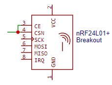
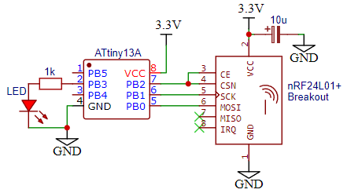

# nRF24L01+ for ATtiny13A ultra-low-power wireless sensor


OSI Layer 2 driver for nRF24L01+ on [ATtiny13A](https://www.microchip.com/en-us/product/ATtiny13) (1KiB flash + 64B SRAM) for ultra low-power wireless applications. It was devised to optimize:
- **Pin-count:** It supports three generic pin-optimization HW configurations that require none or a single resistor. The nRF24 module occupies on MCU only 3 pins instead of 6. This leaves theother 2 pins (+1 if RST used as IO) for attaching sensor(s) or a fieldbuss.

- **Power-consumption:** It was dedicatedly made for ultra-low-power applications. The energy-saving is achieved by the optimized library with a very small number of instructions. This reduces overall execution time. The pin-count is minimized in a way that offers better energy management of the nRF24 module than other similar approaches (shared CE/CSN vs. CE permanently active).

- **Footprint:** Very low footprint - demo applications have 378 bytes (transmitter) and 434 bytes (receiver) including application's logic. It can easily fit into ATtiny13A and leave enough space for other applications and attached devices and field busses. It is configurable for either half-duplex or simplex radio communication to further minimize the footprint. Unlike other generic libraries, it can be also deployed on any other MCU from the ATtiny sub-family with the same or a greater memory. SPI interface is implemented as bit-banging, thus there is no dependency on peripherals such as Universal Serial Interface (USI).

[**More detailed describtion of the library on Hackster.io**](https://www.hackster.io/orfanus/nrf24l01-for-ultra-low-power-sensor-with-attiny13a-3-pins-a51b2c)

## HW Configurations

### (1) Shared CE/CSN pins
Both interface signals are connected to a single pin:



This is useful if the MCU is used for transmissions of data (sensors) to the central hub. Between transmissions the module 
is in the power saving mode (`CE == 0`, i.e. radio is off)  to conserve energy. Applicable for battery powered applications. 

If an application is intended to spend more time in the RX mode than TX, it might be more efficient to not merge CE and CSN. Instead, pulling CE to Vcc (high) would allow ATtiny13A to pool for new messages without a need to switch off the radio.


### (2) Bi-directoinal 3-wire SPI
For situations where MCU needs bi-directional access to the nRF radio module, e.g. reading registers or receiving data. Rather than consuming additional pin on MCU (beside MOSI), both MISO and MOSI can be connected to a single MCU pin via a resistor:


In our case values from 4.7k up to 10k worked well. Merged MISO/MOSI saves one pin which can be used for direct control of CE. If desired, this configuration can be mixed with the first one:


### (3) Uni-directional SPI
There are cases when we do not read anything from the nRF24 module. The device is used only as a data source and for transmission. Thus, we can reduce entire communication on SPI bus only to writting into the module. Signal MISO is not used:


We can combine this configuration with the first one (shared CE/CSN) to further optimize the required pin-count on MCU as shown in the following figure:


### (4) Full (4-wire) SPI
In this case we have separate pins for MOSI and MISO signals, i.e. standard 4-wire SPI. This does not conserve pins on MCU. Nevertheless, the footprint of this solution is 10 bytes (5 instructions) smaller than shared pins. This is useful in application where the code footprint is more critical than number of used pins.

This is the default configuration and it is possible to combine it with the first configuration (shared CE/CSN).


## SW Configuration
By default, the library works with full 4-wire SPI and independent CE and CSN signals. Configuration of the library to work with one of the above described HW options is done by defining corresponding macros in the [projdefs.h](projdefs.h) file.


The HW configuration (1) is **ORTHOGONAL** to the remaining ones (2) -- (4), i.e. it can be used together with any MISO/MOSI combinations. Configurations (2) -- (4) are **MUTUALY EXCLUSIVE**, i.e. only one of them can be enabled (used) in the compiled code.

List of macros for selecting features:
````C
#define NRF24L01_SHARED_CE_CSN`		// Enable HW config (1), can be concurrently used with features (2), (3), and (4).
#define NRF24L01_DO_NOT_USE_MISO	// Enable HW config (2), mutually exclusive with feature (3) and (4) 
#define NRF24L01_3WIRE_SPI		// Enable HW config (3), mutually exclusive with feature (2) and (4)
````
HW config (4) is enabled be default unless config (2) or (3) is enabled (defined). 


Definition to which port is attached which nRF24 signal is also done via macros in the [projdefs.h](projdefs.h) header. Pin configuration macros are:
````C
// MANDATORY macros for port output, port direction and pin reading:
#define NRF24L01_PORT		PORTB
#define NRF24L01_DDR		DDRB
#define NRF24L01_INPORT		PINB
````

Define the following macros (where applicable - see configurations above) for a particular pin setup:
````C
#define NRF24L01_CE     PB0    // Optional. Do not define if shared CE/SCN is enabled 
#define NRF24L01_CSN    PB2    // Mandatory
#define NRF24L01_SCK	PB1    // Mandatory
#define NRF24L01_MOSI	PB3    // Mandatory
#define NRF24L01_MISO	PB4    // Optional. Define only if 4-wire SPI is used.
````

## API

## Demo
Code for working example is in [main.c](main.c) and configuration in [projdefs.h](projdefs.h). The demo consists of both transmitter and receiver. Compilation for either of the application is selected by `#define TRANSMITTER` or `#define RECEIVER` macros. Transmitter periodically sends data (indicated with flashing LED) and receiver flashes LED when receives expected data (increment of the previous sequence number). Demo is fairly simple but shows all what is needed to send/receive any sort of data. 


### Transmitter
The transmitter combines the first (shared CE/CSN) and the third (uni-directional) HW configuration. This occupies 3 pins on MCU, leaving 2 (+1 if no RST) for other devices/sensors/applications:



The application every 2 seconds increments and sends 32-bit unsigned integer to pipe 0 on channel 120. LED turns on for 800ms to indicate the start of the period. The source code shows the entire procedure from powering on the radio, configuring the module, moving data into buffer, transmission, and power of the radio.

The overall **footprint of the transmitter application** including the devised library for nRF24 is **378 bytes (out of 1KiB available)** in flash and 6 bytes SRAM (out of 64).


### Receiver
The receiver application does not utilize shared CE/CSN because the module works only in RX mode and does not transmit data (except for acknowledging packets). To optimize the pin-count we apply 3-wire SPI which occupies on 3 pins:


The application software pools every 100ms status register for new packets. If a packet has arrived, it is read into MCU, and status is cleared. If the received sequence number is identical to the increment of the previous one, the green LED is turned on for 1 second.

The overall **footprint of the receiver application** including the devised library for nRF24 is **434 bytes (out of 1KiB available)** in flash and 6 bytes SRAM (out of 64).
